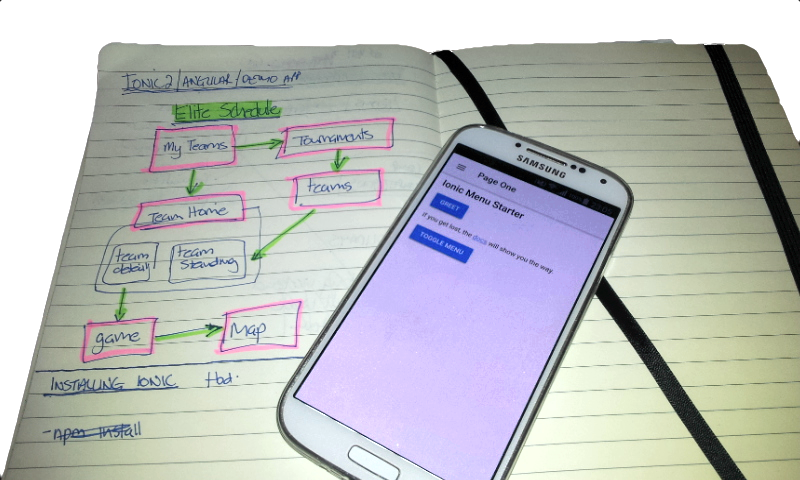

# study-ionic-sandbox

sandbox playground for various ionic experiments - not meant as a public reference. I'm taking more manual notes in my A5 notebook, so don't expect this to be kept as up to date as often as my study-angular project.

Some of the code will be code I've written myself, and other code will most likely be copies of code from `@smichelotti` 's [Ionic2Course](https://github.com/smichelotti/Ionic2Course) as Ive decided to go once through copying his app, before starting my own throw away app based around the learning from the course. [Here is Steve Michelotti's course, `building Mobile Apps with Ionic 2, Angular 2, and Typescript` on pluralsight.](https://github.com/smichelotti/Ionic2Course)

### Installing Ionic

`> npm install -g ionic cordova` 

### fixing node 'EACCES' error

- If the node command (when installing node, or any other npm command) results in `Error: EACCES: permission denied, symlink '../lib/node_modules/cordova/bin/cordova'` then the fix is ***not*** to run as sudo, but rather might be as follows, to fix folder permissions by starting fresh; 
- see https://docs.npmjs.com/getting-started/fixing-npm-permissions
- fix

```
 mkdir ~/npm-global
 npm config set prefix "~/npm-global"
```

  - then add the new path above to your bash shell:
   - `>open ~/npm-global`
   - add `export PATH=~/.npm-global/bin:$PATH` to the bottom of the file and save.
   - close and re-open the terminal (bash) for the path to become active.
  - then re-run the install.
  - it's important to include the quotes above, otherwise it will not be set.
  - to check the npm path has been set correctly, run `npm config get prefix` (this should return the correct path.)

### 100 mile an hour 'android' end to end (tbd)

1. `npm install -g ionic cordova` : skip if you've already installed ionic
1. `ionic start myapp tabs --v2 --ts` : create scaffolded start project
1. `cd myapp`
1. `ionic serve` : manually run and test it
1. `ionic platform add android` : install android native support to your project
1. `ionic build android` : compile the android resources and create a apk file.
1. `ionic emulate android` 
 1. test on a real emulator. 
 1. first build of the emulator will be slow, subsequent will be faster
  1. 1st time took me about 4-5 minutes
  1. 2nd time took 30 seconds after pressing enter in the shell
   1. for the build to run completely
   1. create apk
   1. launch emulator
   1. android emulated device to start
   1. copy and install the apk
   1. the app is running
1. connect your mobile : make sure running in debug mode 
 1. http://android.stackexchange.com/questions/61641/why-is-my-galaxy-s4-still-not-appearing-as-a-device-in-mac-os-x
 1. http://stackoverflow.com/questions/16707137/how-to-find-and-turn-on-usb-debugging-mode-on-nexus-4
1. `ionic run android` : test 

### 8 simple 1 line commands to gaurantee a super interesting dev meetup ` ¯\_(ツ)_/¯ `

```
  npm install -g ionic cordova 
  ionic start myapp tabs --v2 --ts
  cd myapp
  ionic serve
  ionic platform add android
  ionic build android
  ionic emulate android
  ionic run android
```
***result***



### Likes and dislikes

#### Likes

- tbd, this is a long list.
- speed, speed, speed. (er, of development, not app, cof cof! blush!)
- I was up and running and way past where I was with Xamarin studio and Xamarin Forms in only a few hours.
- everything (touch wood) so far, `just works!`. In a wonderful way that stuff just so often did NOT work with Xamarin.
- Even when things did not work, it was really easy to find a fix.
- error messages so far have been out of this world awesome. (nb, need reference, see if I can remember specific examples?)
- Typescript means I can slowly get into `Javascript the good parts`.
- I love how Angular2 protects me from `CSS hell`. CSS does not bleed out from parent into child.
- I have not got into testing yet, but I have a strong sense that this will all be a whole lot more automatable, and components and libs can be independantly unit tested at high speed.


#### dislikes

- this is a very short list, actually just 1 thing so far, ***load time!*** 
 - Around 10 seconds for a vanilla out of the box scafolded app in debug mode (i.e. without `--prod` set. )
 - here's some skinny on load times, ...scroll all the way to the bottom 
 - https://forum.ionicframework.com/t/ionic-2-speed-up-boot-time/46372/135

#### pausing

https://app.pluralsight.com/player?course=ionic2-angular2-typescript-mobile-apps&author=steve-michelotti&name=ionic2-angular2-typescript-mobile-apps-m2&clip=6&mode=live
 
 run apps with ionic view
 